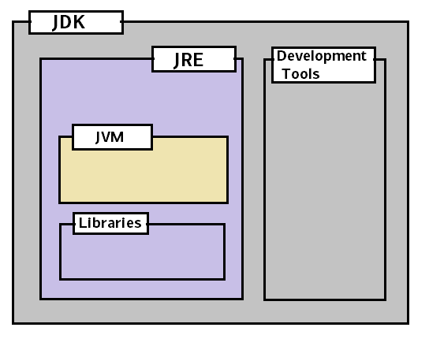

# Getting Started
---
## 1. Spring Boot 소개 
Spring Boot는 Spring framework 기반의 application 프로젝트를 복잡한 설정 없이 쉽고 빠르게 만들어줍니다.
("spring scripts"를 실행시킬 수 있는 command line tool도 제공함)

Spring Boot의 주요 목표
- Spring 개발을 위해 더 빠르고 광범위하게 접근 가능한 시작 경험(개발 초기 환경)을 제공하는 것입니다.
- 추가적인 설정 없이 사용하는 것을 지향하지만, 변경 사항이 필요하다면 바로 변경 가능하다.
- 많은 종류의 프로젝트(예: 내장형 서버, 보안, 메트릭, 상태 점검 및 외부 구성)에 공통적으로 사용되는 다양한 non-functional 기능을 제공합니다.
- 코드 생성도 없고 XML 구성도 필요하지 않습니다.

## 2. System 요구 사항
*Spring Boot 2.4.3 기준* 

|언어 / framework|지원 버전|
|------|---|
|JAVA|8 ~ 15|
|Spring Framework|5.3.2 이상|
|Maven|3.3 이상|
|Gradle|6(6.3이상, 5.6.x도 지원되지만 더 이상 사용하지않음|

### 2.1 Servlet Containers 
|이름|Servlet 버전|
|------|---|
|Tomcat 9.0|4.0|
|Jetty 9.4|3.1|
|Undertow 2.0|4.0|

## 3. Spring Boot 설치
-  [Java SDK v1.8](https://www.java.com/ko/) 이상 필요
- Java 개발이 처음이고 Spring Boot를 사용해보고싶다면 -> [Spring Boot CLI](https://docs.spring.io/spring-boot/docs/2.4.3/reference/html/getting-started.html#getting-started-installing-the-cli) 
    > <details>
    ###### <summary> SDK, JDK, JRE </summary>
    <div markdown="1">
    
        의미로만 따진다면 SDK > JDK   
        SDK(Software Development Kit) : Software 개발 도구   
        JDK(Java Development Kit) : Java 개발 도구    
            
        출처 : [Introduction to JVM, JDK, JRE](https://www.techbeamers.com/introduction-jvm-jdk-jre)
    </div>
     
    </details>
    
### 3.1 Java 개발자를 위한 설치 지침

표준 java library 형태로 spring boot를 사용하고싶다면, spring-boot-*.jar를 classpath에 포함시키면 사용 가능하다.
그러나, 빌드 도구(Maven 또는 Gradle)를 사용하는 것을 추천한다.

#### 3.1.1 Maven 설치
- Apache Maven 3.3 이상과 호환
```shell script
OSW Homebrew -> brew install maven
Ubuntu -> sudo apt-get insall maven
Chocolatey를 사용하는 Windows -> choco install maven 
```
각자 환경에 맞는 명령어로 maven 설치 후 -> [Maven 시작하기](https://docs.spring.io/spring-boot/docs/2.4.3/maven-plugin/reference/htmlsingle/#getting-started)

#### 3.1.2 Gradle 설치
- Gradle 6 (6.3 이상)과 호환
- Gradle 5.6.x도 지원하지만 추후 release 시 deprecate
- Gradle의 경우 [Gradle Wrapper](https://docs.gradle.org/current/userguide/gradle_wrapper.html)를 사용하는 것을 추천함

Gradle Wrapper 또는 Gradle 설치 후 -> [Gradle 시작하기](https://docs.spring.io/spring-boot/docs/2.4.3/gradle-plugin/reference/htmlsingle/#getting-started)

### 3.2 Spring Boot CLI 설치
Spring Boot ClI(Command Line Interface)는 Grrovy 스크립트를 실행 가능함.
   > [BuildTool - Groovy란? (Groovy 문법과, 초간단 build.gradle 작성 예)](https://galid1.tistory.com/647)   
<details>
<summary>설치 방법들</summary>

<div markdown="1">

#### 3.2.1 수동으로 설치   
#### 3.2.2 SDKMAN으로 설치   
#### 3.2.3 OSX Homebrew 설치 
#### 3.2.4 MacPorts 설치
#### 3.2.6 Command-line Completion
#### 3.2.7 빠르게 시작하는 Spring CLI 예제
</div>
</details>

### 3.3 Spring Boot 버전 업그레이드
- 1.x Spring Boot 버전일 경우 [project wiki의 "migration guide"](https://github.com/spring-projects/spring-boot/wiki/Spring-Boot-2.0-Migration-Guide) 참고
- 각 release 별 feature 는 ["release notes"](https://github.com/spring-projects/spring-boot/wiki)를 참고
- 1.x 버전 이상인 경우 migrator 사용
    - 버전 업그레이드 시, 설정의 이름이 변경되거나 위치가 변경될 수 있다.
    - spring boot의 migrator를 사용하면 시작할 때 app의 환경을 분석하고 진단(?)을 print 해줄 뿐만 아니라,    
      runtime 시 일시적으로 속성을 migration할 수 있다.
      ```xml
      <dependency>
          <groupId>org.springframework.boot</groupId>
          <artifactId>spring-boot-properties-migrator</artifactId>
          <scope>runtime</scope>
      </dependency>
      ```
- __주의사항__
  - Properties that are added late to the environment, such as when using tag, will not be taken into account.
  - Once you’re done with the migration, please make sure to remove this module from your project’s dependencies.
    - cli 설치 upgrade 시, package mager command를 사용해야한다 ``brew upgrade``
    - cli를 수동으로 설치한 경우 -> [standard instructions](https://docs.spring.io/spring-boot/docs/2.4.3/reference/html/getting-started.html#getting-started-manual-cli-installation) 를 따르고, PATH 환경변수를 수정한다.


## 4. 첫 번째 Spring Boot Application 개발
> [spring.io](https://spring.io/) 에서는 많은 "Getting Started" [가이드](https://spring.io/guides)가 있다. 특정한 문제 발생 시, 가이드 페이지를 먼저 확인하면 좋다.   
  [start.spring.io](https://start.spring.io/) 에서 간단한 설정과 denpendencies만 설정하면 [바로 개발 할 수 있다.](https://docs.spring.io/spring-boot/docs/2.4.3/reference/html/getting-started.html#getting-started-first-application-code)   
>자세한 내용은 [Spring Initializr documentation](https://docs.spring.io/initializr/docs/current/reference/html/#user-guide)를 참고하면 된다.

공식 문서에서는 Maven을 사용한 예시를 사용한다.

### 4.1 POM 생성
<details>
<summary>pom.xml</summary>
<div markdown="1">

```xml
<?xml version="1.0" encoding="UTF-8"?>
<project xmlns="http://maven.apache.org/POM/4.0.0" xmlns:xsi="http://www.w3.org/2001/XMLSchema-instance"
    xsi:schemaLocation="http://maven.apache.org/POM/4.0.0 https://maven.apache.org/xsd/maven-4.0.0.xsd">
    <modelVersion>4.0.0</modelVersion>

    <groupId>com.example</groupId>
    <artifactId>myproject</artifactId>
    <version>0.0.1-SNAPSHOT</version>

    <parent>
        <groupId>org.springframework.boot</groupId>
        <artifactId>spring-boot-starter-parent</artifactId>
        <version>2.4.3</version>
    </parent>

    <description/>
    <developers>
        <developer/>
    </developers>
    <licenses>
        <license/>
    </licenses>
    <scm>
        <url/>
    </scm>
    <url/>

    <!-- Additional lines to be added here... -->

</project>
```
```mvn package``` 명령어를 통해서 테스트를 할 수 있다.
</div>
</details>

### 4.2 클래스 경로 종속성 추가

Spring Boot는 여러 "Starters"를 제공한다. 여기서는 Smoke 테스트를 위해 pom의 ```parent``` section에 ```spring-boot-starter-parent```을 사용한다.   
```spring-boot-starter-parent```는 유용한 maven defaults를 제공하는 특별한 starter입니다.```(spring-boot-starter-parent는 starter에 의해 추가된 라이브러리 간의 의존성 조합 충돌을 막기 위해 충돌 문제가 없는 검증된 버전 정보 조합을 제공합니다.)```   
```dependency-management``` section을 제공하여 ```version``` 정보를 생략할 수 있습니다.   

다른 "Starters"들은 특정한 유형의 application을 개발 할 때 필요한 종속성을 제공한다. 만약, web application 개발을 하고싶다면, ```spring-boot-starter-web``` dependency를 추가하면 된다.

아래 명령을 통해서 현재 실행중인 app의 종속성을 확인할 수 있다.
```
  $ mvn dependency:tree
  
  [INFO] com.example:myproject:jar:0.0.1-SNAPSHOT
```
```spring-boot-starter-parent``` 자체적으로는 종속성을 제공하고 있지 않기 때문에 직접 ```pom.xml```을 수정해서 필요한 종속성을 추가해야한다.
```xml
<dependencies>
    <dependency>
        <groupId>org.springframework.boot</groupId>
        <artifactId>spring-boot-starter-web</artifactId>
    </dependency>
</dependencies>
```

### 4.3 code 작성
기본적으로 Maven은 ```src/main/java``` 디렉터리에서 컴파일을 하기 때문에 이 구조로 티렉터리를 만들고 ```java``` 디렉터리 하위에 ```Example.java``` 파일을 생성한다.
```java
import org.springframework.boot.*;
import org.springframework.boot.autoconfigure.*;
import org.springframework.web.bind.annotation.*;

@RestController
@EnableAutoConfiguration
public class Example {

    @RequestMapping("/")
    String home() {
        return "Hello World!";
    }

    public static void main(String[] args) {
        SpringApplication.run(Example.class, args);
    }

}
```

#### 4.3.1 ```@RestController```, ```@RequestMapping``` Annotation
1. ```@RestController```
 - stereotype annotation: spring container가 spring 관리 component로 식별하게 해주는 annotation. scan-auto-detection과 dependency injection을 사용하기 위해서 사용되는 가장 기본 annotation.
 - 이 예제에서는 web ```@Controoler```이기 때문에, Spring으로 들어오는 web 요청을 고려해야한다.
2. ```@RequestMapping```
 - 라우팅 정보를 제공한다.
 - ```/``` 경로가 있는 모든 HTTP 요청이 ```home``` method에 매핑되어야한다.
 - ```@RequstMapping``` annotation은 caller에게 ```home``` method의 return 값을 렌더링하기 위해서 전달한다.
   > The @RestController and @RequestMapping annotations are Spring MVC annotations (they are not specific to Spring Boot). See the [MVC section](https://docs.spring.io/spring-framework/docs/5.3.4/reference/html/web.html#mvc) in the Spring Reference Documentation for more details.   

#### 4.3.2 ```@EnableAutoConfiguration``` Annotaion
```@EnableAutoConfiguration``` annotaion은 개발자가 추가한 jar dependencies를 고려해서 개발하도록 알려주는 annotation.
```spring-boot-starter-web``` Tomcat과 Spring MVC가 추가되었기 때문에 auto-configuration은 web application을 개발한다고 가정하고 그에 따라 Spring을 설정해야 한다.

       ##Starters and Auto-configuration##   
       Auto-configuration is designed to work well with “Starters”, but the two concepts are not directly tied.    
       You are free to pick and choose jar dependencies outside of the starters. Spring Boot still does its best to auto-configure your application.

### 4.3.3 The “main” Method
***This is a standard method that follows the Java convention for an application entry point.***   
```main``` method 내에서 ```SpringApplication.run(Example.class, args);```을 호출함으로써 Spring Boot의 ```SpringApplication``` class에 위임한다.   
SpringApplication bootstraps는 자동 구성된 Tomcat 웹 서버를 실행하는 Spring을 실행시켜서 application을 실행시킨다.

## 4.4 예제 실행

```shell script
$ mvn spring-boot : run

  . ____ _ __ _ _
 / \\ / ___'_ __ _ _ (_) _ __ __ _ \ \ \ \
(() \ ___ | '_ |'_ | | '_ \ / _` | \ \ \ \
 \\ / ___) | | _) | | | | | || (_ | |))))
  '| ____ | .__ | _ | | _ | _ | | _ \ __, | / / / /
 ========= | _ | ============= | ___ / = / _ / _ / _ /
 :: Spring Boot :: (v2.4.3)
........ . .
........ . . (여기에 로그 출력)
........ . .
........ 2.222 초 만에 시작된 예제 (JVM 6.514 실행)
```
웹 브라우저를 열면 ```localhost:8080``` 페이지에 아래와 같이 출력되어야한다.
```html
안녕하세요!
```

## 4.5 Creating an Executable Jar
Executable Jar("fat jars"로도 불림) : 필요한 의존성(모든 dependency jar 포함)을 모두 가지고, 실행이 가능한 jar file이다.   

> java에는 nested jar 파일을 불러오는 표준 방법이 없습니다. 이를 위해 "uber" jar를 사용합니다. 하지만 uber jar 또한 어떤 라이브러리를 쓰는지 알기 어렵고, 같은 이름을 가진 파일이 있으면 문제가 될 수 있습니다.   
> 그래서 스프링 부트는 [다른 방법](https://docs.spring.io/spring-boot/docs/2.4.3/reference/html/appendix-executable-jar-format.html#executable-jar)을 사용합니다.

다음과 같이 명령 줄에서 저장 ```pom.xml```하고 실행 ```mvn package```합니다.
```shell script
$ mvn package

[INFO] Scanning for projects...
[INFO]
[INFO] ------------------------------------------------------------------------
[INFO] Building myproject 0.0.1-SNAPSHOT
[INFO] ------------------------------------------------------------------------
[INFO] .... ..
[INFO] --- maven-jar-plugin:2.4:jar (default-jar) @ myproject ---
[INFO] Building jar: /Users/developer/example/spring-boot-example/target/myproject-0.0.1-SNAPSHOT.jar
[INFO]
[INFO] --- spring-boot-maven-plugin:2.4.3:repackage (default) @ myproject ---
[INFO] ------------------------------------------------------------------------
[INFO] BUILD SUCCESS
[INFO] ------------------------------------------------------------------------
```

```target``` 디렉터리에 ```myproject-0.0.1-SNAPSHOT.jar```가 있다면 아래 명령어를 실행한다.
```shell script
$ jar tvf target/myproject-0.0.1-SNAPSHOT.jar
```
Spring Boot에 의해 리패키지되기 전 original 파일을 ```target``` 디렉터리의 ```myproject-0.0.1-SNAPSHOT.jar.original``` 이름으로 볼 수 있다.   
```myproject-0.0.1-SNAPSHOT.jar.original``` 파일이 ```myproject-0.0.1-SNAPSHOT.jar``` 파일보다 파일크기가 더 적다.

파일을 실행시키려면 ```java -jar``` 명령어를 아래같이 실행하면된다.
```shell script
$ java -jar target/myproject-0.0.1-SNAPSHOT.jar

  .   ____          _            __ _ _
 /\\ / ___'_ __ _ _(_)_ __  __ _ \ \ \ \
( ( )\___ | '_ | '_| | '_ \/ _` | \ \ \ \
 \\/  ___)| |_)| | | | | || (_| |  ) ) ) )
  '  |____| .__|_| |_|_| |_\__, | / / / /
 =========|_|==============|___/=/_/_/_/
 :: Spring Boot ::  (v2.4.3)
....... . . .
....... . . . (log output here)
....... . . .
........ Started Example in 2.536 seconds (JVM running for 2.864)
```

## 5. What to Read Next

- [spring.io](https://spring.io)로 이동해서 [getting started](https://spring.io/guides/) 
- Spring Boot에 관한 ["How-to"](https://docs.spring.io/spring-boot/docs/2.4.3/reference/html/howto.html#howto) 문서
- [***using-spring-boot.html.***](https://docs.spring.io/spring-boot/docs/2.4.3/reference/html/using-spring-boot.html#using-boot)
- [***Spring Boot features***](https://docs.spring.io/spring-boot/docs/2.4.3/reference/html/spring-boot-features.html#boot-features)
