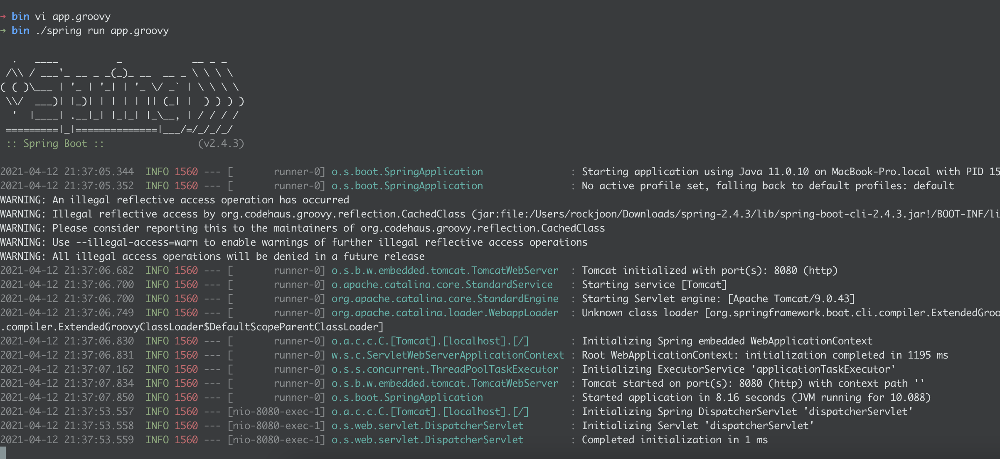

# Week 2 Getting Started

## 스프링 부트의 특징

### 1. stand-alone

스프링 부트는 단독으로 실행 가능한 어플리케이션이다.  
war로 패키징하여 톰캣 등의 컨테이너와 각종 주변 환경이 필요 했던 스프링과 비교된다.

### 2. opinionated view

[opinionated software란](https://stackoverflow.com/questions/802050/what-is-opinionated-software)  
특정한 요구사항을 달성하기 위한 방법이 정해져 있다.  
이로 인해 개발의 복잡성이 줄어 들고 요구 사항을 빠르게 달성할 수 있다.

### 3. radically fast and widely accessible

기본적으로 필요한 기능이 내장되어 있고, 간단하게 필요한 것을 추가할 수 있다.  
따라서 매우 빠르고 쉽게 스프링 개발 환경을 구축할 수 있다.

### 4. 다양한 기능 제공

내장 서버, 스프링 시큐리티, 상태 체크 등의 다양한 기능을 제공한다.


## Spring Boot CLI

스프링 부트는 CLI를 제공한다. cli에서는 groovy 스크립트를 사용할 수 있고,  
이를 통해 빠르게 spring boot의 프로토 타입을 시험해 볼 수 있다. 

```groovy
@RestController
class ThisWillActuallyRun {

    @RequestMapping("/")
    String home() {
        "Hello World!"
    }

}
```
이와 같은 groovy 스크립트를 작성하고, cli환경에서 실행하면  
아주 빠르게 스프링 부트를 구동시킬 수 있다.


## Writting the Code

```java
@RestController
@EnableAutoConfiguration
public class Example {

    @RequestMapping("/")
    String home() {
        return "Hello World!";
    }

    public static void main(String[] args) {
        SpringApplication.run(Example.class, args);
    }

}
```

### EnableAutoConfiguration annotation

* 내가 추가한 jar dependencies에 맞게 **자동으로** 환경 설정을 해준다.
* 예를 들어 spring-boot-starter-web 의존성은 톰캣과 Spring MVC를 추가해주는데,
* 이를 통해 스프링은 이 어플리케이션이 **웹 어플리케이션임을 판단하고 그에 맞는 설정**을 해준다.

### 'main' method

* 스프링 부트에서도 일반적인 자바 컨벤션과 마찬가지로 main메서드가 시작점이 된다.
* main메서드에서는 SpringApplication의 run함수를 호출한다.
* 이를 통해 어플리케이션이 시작되고, 톰캣 웹서버와 각종 스프링 컴포넌트를 작동시킨다.
