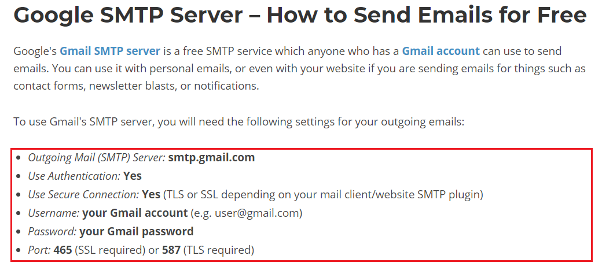

# Week 10 Sending Mail

##

스프링 부트에서는 메일 인터페이스를 추상화하여 손쉽게 메일을 발송할 수 있다.

## 1. 의존성 추가

스프링 부트 스타터에서 메일과 관련된 의존성을 제공한다.
```aidl
implementation 'org.springframework.boot:spring-boot-starter-mail'
```
이 의존성을 추가하면 JavaMail / Jakarta Mail 등의 라이브러리가 자동으로 추가된다.

## 2. SMTP 설정
구글에서 무료로 SMTP 서버를 제공한다.  
다음과 같은 smtp 정보가 필요 하다.



## 3. MailSender

```java
public interface MailSender {

	void send(SimpleMailMessage simpleMessage) throws MailException;

	void send(SimpleMailMessage... simpleMessages) throws MailException;

}
```

## 4. SimpleMailMessage
단순히 텍스트를 보내기 위해서는 `SimpleMailMessage`객체를 이용하면된다.  
수신자, 발신자, 제목, 내용 등을 지정하고 보내면 끝~
```java
    public void sendMail() {
        SimpleMailMessage simpleMailMessage = new SimpleMailMessage();
        simpleMailMessage.setFrom("rockpago@gmail.com");
        simpleMailMessage.setTo("abc@gmail.com");
        simpleMailMessage.setSubject("제목");
        simpleMailMessage.setText("내용");
        
        mailSender.send(simpleMailMessage);
    }

```

## 5. MimeMailMessage
첨부 파일이나 html 등을 보내기 위해서 `MimeMailMessage`를 사용할 수 있다.
```java
public void sendMIMEMail() throws MessagingException {
    MimeMessage mimeMessage = javaMailSender.createMimeMessage();
    mimeMessage.setFrom("rockpago@gmail.com");
    mimeMessage.setSubject("제목");
    mimeMessage.setText("<html><body>안녕하세요</body></html>");
    mailSender.send(mimeMessage);
}
```

## 6. MimeMessageHelper
Mime를 좀더 쉽게 만들기 위해 `MimeMessageHelper`를 사용할 수 있다.
```java
MimeMessageHelper mimeMessageHelper = new MimeMessageHelper(mimeMessage);
mimeMessageHelper.addAttachment("test.png", file);
```