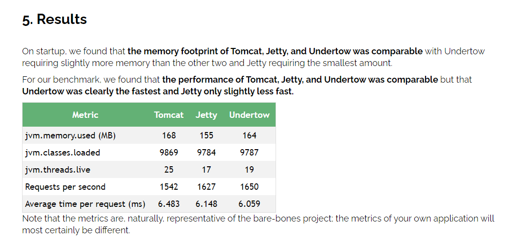
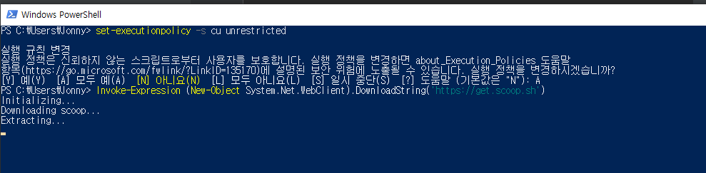
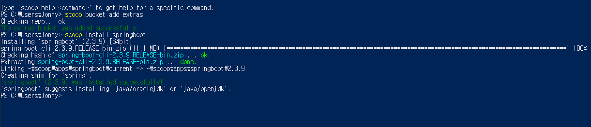
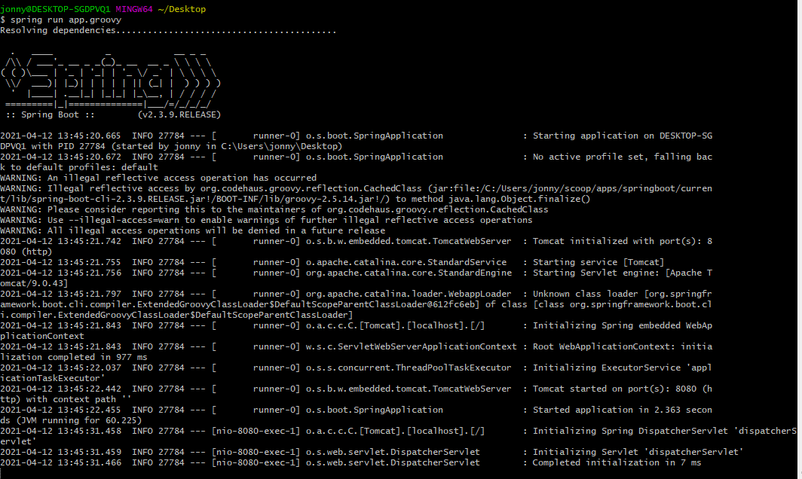
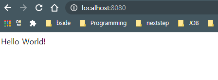

# 1. Getting Started

### 

- what - **introduction** to Spring Boot with installation instructions
- how - **building** your first Spring Boot application
- why - discussing some core **principles**

## 1. introduction to Spring Boot with installation instructions

Spring Boot helps you to create **stand-alone**, **production-grade** Spring-based Applications that you can run.

**We take an opinionated** view of the Spring platform and third-party libraries, so that you can get started with **minimum fuss**.

Most Spring Boot applications need **very little Spring configuration**.

You can use Spring Boot to create Java applications that can be started by using java -jar or more traditional war deployments. We also provide a command line tool that runs “**spring scripts**”.

Our primary goals are:

1. Provide a **radically faster and widely accessible** getting-started experience for all Spring development. 모든 스프링 개발환경을 위해 빠르고 광범위하게 접근가능한 스타트 경험을 제공한다. (기본설정이 있어서 빠르게 시작가능)
2. Be opinionated out of the box but get out of the way **quickly** as requirements start to **diverge from the defaults**. 요구사항에 맞게 기본설정에서 빠르게 벗어날수 있다. (설정 커스터마이징이 쉽다.)
3. Provide a range of **non-functional features** that are common to large classes of projects (such as embedded servers, security, metrics, health checks, and externalized configuration). 대규모 프로젝트 클래스 (예 : 임베디드 서버, 보안, 메트릭, 상태 확인 및 외부화 된 구성)에 공통되는 다양한 non-functional 기능을 제공합니다.
4. Absolutely **no code generation** and no requirement for **XML configuration**. 코드생성 절대 없음. XML 설정이 필수 아님

## 2. System Requirements

- java8 이상 (15까지 호환)
- 스프링 5.3.4 이상
- maven 3.3 이상
- gradle 6.3 이상 (5.6도 지원은 함)

## 2.1. Servlet Containers

Tomcat 9.0 | 4.0

Jetty 9.4 | 3.1

Undertow 2.0 | 4.0

[내장 Tomcat과 외장 Tomcat의 간단한 비교 - zepinos](https://zepinos.tistory.com/51)

[Spring Boot 공식 지원 내장 WAS 인 Undertow 을 씁시다 - zepinos](https://zepinos.tistory.com/35)

[Comparing Embedded Servlet Containers in Spring Boot - Baeldung](https://www.baeldung.com/spring-boot-servlet-containers)



- 톰캣 설치 + war, 내장 톰캣 경험만 있는데, Undertow를 한번 써봐야겠다는 생각을 했습니다.
- 여러분들은 어떤 WAS를 사용하시나요?

## 3. Installing Spring Boot

- SDK v1.8 이상 필요

### 3.1 Installation Instructions for the Java Developer

You can use Spring Boot in the same way as any standard Java library. To do so, include the appropriate spring-boot-*.jar files on your classpath. **Spring Boot does not require any special tools integration, so you can use any IDE or text editor**. Also, there is nothing special about a Spring Boot application, so you can run and debug a Spring Boot application as you would any other Java program.

Although you could copy Spring Boot jars, we generally recommend that you use a build tool that supports dependency management (such as Maven or Gradle).

- 왜 의존성 관리를 위한 빌드 툴 (Maven or Gradle)을 쓰는 것이 좋을까? → 2장

### 3.1.1. Maven Installation

- 스프링부트는 Maven 3.3 이상과 호환됨.

Spring Boot dependencies use the `org.springframework.boot` `groupId`. Typically, your Maven POM file **inherits** from the `spring-boot-starter-parent` project and declares dependencies to one or more [“Starters”](https://docs.spring.io/spring-boot/docs/current/reference/html/using-spring-boot.html#using-boot-starter). Spring Boot also provides an optional [Maven plugin](https://docs.spring.io/spring-boot/docs/current/reference/html/build-tool-plugins.html#build-tool-plugins-maven-plugin) to create executable jars.

More details on getting started with Spring Boot and Maven can be found in the [Getting Started section](https://docs.spring.io/spring-boot/docs/2.4.4/maven-plugin/reference/htmlsingle/#getting-started) of the Maven plugin’s reference guide.

Spring Boot 종속성은 org.springframework.boot groupId를 사용합니다. 일반적으로 Maven POM 파일은 spring-boot-starter-parent 프로젝트에서 상속되며 하나 이상의 "스타터"에 대한 종속성을 선언합니다. Spring Boot는 실행 가능한 jar를 생성하기위한 선택적 Maven 플러그인도 제공합니다.

### 3.1.2. Gradle Installation

- 그래이들 6.3 이상 호환
- 5.6.x도 지원은하지만 deprecated

Spring Boot dependencies can be declared by using the org.springframework.boot group. Typically, your project declares dependencies to one or more “Starters”. Spring Boot provides a useful Gradle plugin that can be used to simplify dependency declarations and to create executable jars.

Spring Boot 종속성은 org.springframework.boot 그룹을 사용하여 선언 할 수 있습니다. 일반적으로 프로젝트는 하나 이상의 "스타터"에 대한 종속성을 선언합니다. Spring Boot는 종속성 선언을 단순화하고 실행 가능한 jar를 만드는 데 사용할 수있는 유용한 Gradle 플러그인을 제공합니다.

[https://jisooo.tistory.com/entry/Spring-빌드-관리-도구-Maven과-Gradle-비교하기](https://jisooo.tistory.com/entry/Spring-%EB%B9%8C%EB%93%9C-%EA%B4%80%EB%A6%AC-%EB%8F%84%EA%B5%AC-Maven%EA%B3%BC-Gradle-%EB%B9%84%EA%B5%90%ED%95%98%EA%B8%B0)

### 3.2. Installing the Spring Boot CLI

The Spring Boot CLI (Command Line Interface) is a **command line tool that you can use to quickly prototype with Spring**. It lets you run Groovy scripts, which means that you have a familiar Java-like syntax without so much boilerplate code.

You do not need to use the CLI to work with Spring Boot, but it is definitely the **quickest way to get a Spring application off the ground.**

### 3.2.1. Manual Installation

### 3.2.2. Installation with SDKMAN!

### 3.2.3. OSX Homebrew Installation

### 3.2.4. MacPorts Installation

### 3.2.5. Command-line Completion

### 3.2.6. Windows Scoop Installation

If you are on a Windows and use Scoop, you can install the Spring Boot CLI by using the following commands:

```
> scoop bucket add extras
> scoop install springboot
```

윈도우에 scoop 설치하기

powershell

- 실행 규칙 변경
- scoop 다운로드

```powershell
set-executionpolicy -s cu unrestricted
Invoke-Expression (New-Object System.Net.WebClient).DownloadString('[https://get.scoop.sh](https://get.scoop.sh/)')
```



```powershell
scoop help
scoop bucket add extras
scoop install springboot
```



Scoop installs spring to ~/scoop/apps/springboot/current/bin.

3.2.7. Quick-start Spring CLI Example

- 아무 폴더에 app.groovy 파일을 만들고 다음 코드 작성

```groovy
@RestController
class ThisWillActuallyRun {

    @RequestMapping("/")
    String home() {
        "Hello World!"
    }

}
```

```powershell
spring run app.groovy
```





### 3.3. Upgrading from an Earlier Version of Spring Boot

## 4. Developing Your First Spring Boot Application

### 4.1. Creating the POM

### 4.2. Adding Classpath Dependencies

Spring Boot provides a number of “Starters” that let you add jars to your classpath. Our applications for smoke tests use the spring-boot-starter-parent in the parent section of the POM. The spring-boot-starter-parent is a special starter that provides useful Maven defaults. It also provides a dependency-management section so that **you can omit version tags for “blessed” dependencies**.

- 어떤 특별한 의존성들은 버전 태그를 생략해도 된다.  spring-boot-starter-parent가 default version을 가지고 있기 때문!

### 4.3. Writing the Code

```java
import org.springframework.boot.*;
import org.springframework.boot.autoconfigure.*;
import org.springframework.web.bind.annotation.*;

@RestController
@EnableAutoConfiguration
public class Example {

    @RequestMapping("/")
    String home() {
        return "Hello World!";
    }

    public static void main(String[] args) {
        SpringApplication.run(Example.class, args);
    }

}
```

### 4.3.1. The @RestController and @RequestMapping Annotations

The first annotation on our Example class is @RestController. This is known as a stereotype annotation. It provides hints for people reading the code and for Spring that the class plays a specific role. **In this case, our class is a web @Controller, so Spring considers it when handling incoming web requests.**

The @RequestMapping annotation provides “routing” information. It tells Spring that any HTTP request with the / path should be mapped to the home method. **The @RestController annotation tells Spring to render the resulting string directly back to the caller.**

### 4.3.2. The @EnableAutoConfiguration Annotation

The second class-level annotation is @EnableAutoConfiguration. **This annotation tells Spring Boot to “guess” how you want to configure Spring, based on the jar dependencies that you have added**. Since spring-boot-starter-web added Tomcat and Spring MVC, the auto-configuration **assumes** that you are developing a web application and sets up Spring accordingly.

두 번째 클래스 수준 주석은 @EnableAutoConfiguration입니다. 이 주석은 추가 한 jar 종속성에 따라 Spring을 구성하는 방법을 "추측"하도록 Spring Boot에 지시합니다. spring-boot-starter-web은 Tomcat과 Spring MVC를 추가했기 때문에 자동 구성은 웹 애플리케이션을 개발 중이라고 가정하고 그에 따라 Spring을 설정합니다.

Starters and Auto-configuration

Auto-configuration is designed to work well with “Starters”, but the two concepts are not directly tied. **You are free to pick and choose jar dependencies outside of the starters**. Spring Boot still does its best to auto-configure your application.

스타터 및 자동 구성
자동 구성은 "스타터"와 잘 작동하도록 설계되었지만 두 개념이 직접적으로 연결되어 있지는 않습니다. **스타터 외부에서 jar 종속성을 자유롭게 선택하고 선택할 수 있습니다**. Spring Boot는 여전히 애플리케이션을 자동 구성하기 위해 최선을 다합니다.

### 4.3.3. The “main” Method

The final part of our application is the main method. This is a **standard method that follows the Java convention** for an application entry point. **Our main method delegates to Spring Boot’s SpringApplication class by calling run**. SpringApplication bootstraps our application, starting Spring, which, in turn, starts the auto-configured Tomcat web server. We need to pass Example.class as an argument to the run method to tell SpringApplication which is the primary Spring component. The args array is also passed through to expose any command-line arguments.

우리 응용 프로그램의 마지막 부분은 main method입니다. 이것은 애플리케이션 진입 점에 대한 Java 규칙을 따르는 표준 방법입니다. 우리의 main method는 **run을 호출하여 Spring Boot의 SpringApplication 클래스에 위임합니다.** SpringApplication은 자동 구성 Tomcat 웹 서버를 시작하는 Spring을 시작하여 애플리케이션을 부트 스트랩합니다. Example.class를 run 메소드에 대한 인수로 전달하여 SpringApplication에 기본 Spring 컴포넌트를 알려야합니다. args 배열도 전달되어 command-line arguments를 노출합니다.

### 4.4. Running the Example

At this point, your application should work. Since you used the spring-boot-starter-parent POM, you have a useful run goal that you can use to start the application. Type mvn spring-boot:run from the root project directory to start the application. You should see output similar to the following:

`$ mvn spring-boot:run`

### 4.5. Creating an Executable Jar

We finish our example by creating a completely self-contained executable jar file that we could run in production. Executable jars (sometimes called “fat jars”) are archives containing your compiled classes along with all of the jar dependencies that your code needs to run.

우리는 프로덕션에서 실행할 수있는 완전히 독립적으로 실행 가능한 jar 파일을 생성하여 예제를 마칩니다. 실행 가능한 jar ( "fat jar"라고도 함)는 코드를 실행하는 데 필요한 모든 jar 종속성과 함께 컴파일 된 클래스를 포함합니다.

Executable jars and Java

**Java does not provide a standard way to load nested jar files** (jar files that are themselves contained within a jar). This can be problematic if you are looking to distribute a self-contained application.

To solve this problem, many developers use **“uber” jars**. An uber jar packages all the classes from all the application’s dependencies into a single archive. The problem with this approach is that it becomes hard to see which libraries are in your application. It can also be problematic if the same filename is used (but with different content) in multiple jars.

Spring Boot takes a [different approach](https://docs.spring.io/spring-boot/docs/current/reference/html/appendix-executable-jar-format.html#executable-jar) and lets you actually nest jars directly.

실행 가능한 jar 및 Java
Java는 중첩 된 jar 파일 (jar 내에 포함 된 jar 파일)을로드하는 표준 방법을 제공하지 않습니다. 자체 포함 된 응용 프로그램을 배포하려는 경우 문제가 될 수 있습니다.

이 문제를 해결하기 위해 많은 개발자가 **"uber"jar**를 사용합니다. uber jar는 모든 애플리케이션 종속성의 모든 클래스를 단일 아카이브로 패키징합니다. 이 접근 방식의 문제점은 애플리케이션에 어떤 라이브러리가 있는지 확인하기가 어렵다는 것입니다. 여러 jar에서 동일한 파일 이름을 사용하는 경우 (그러나 다른 내용으로) 문제가 될 수도 있습니다.

Spring Boot는 다른 접근 방식을 취하며 실제로 jar를 직접 중첩 할 수 있습니다.

fat jars - self-contained executable jar

uber jars - a single archive packaging all the classes from all the application’s dependencies

```shell
$ mvn package
```

If you look in the `target` directory, you should see `myproject-0.0.1-SNAPSHOT.jar`. The file should be around 10 MB in size. If you want to peek inside, you can use jar tvf, as follows:

```shell
$ jar tvf target/myproject-0.0.1-SNAPSHOT.jar
```

You should also see a much smaller file named `myproject-0.0.1-SNAPSHOT.jar.original` in the target directory. This is the **original jar file that Maven created before it was repackaged by Spring Boot.**

To run that application, use the `java -jar` command, as follows:

```shell
$ java -jar target/myproject-0.0.1-SNAPSHOT.jar
```

메이븐을 이용해 스프링부트 프로젝트를 실행하는 방법

1. 루트 프로젝트 디렉터리에서 `mvn spring-boot:run` 명령어로 시작
2. `mvn package` 명령어로 jar파일 생성 후 java -jar 명령어로 jar를 실행 `java -jar target/myproject-0.0.1-SNAPSHOT.jar`

## 5. What to Read Next

Hopefully, this section provided some of the Spring Boot basics and got you on your way to writing your own applications. If you are a task-oriented type of developer, you might want to jump over to [spring.io](https://spring.io/) and check out some of the [getting started](https://spring.io/guides/) guides that solve specific “How do I do that with Spring?” problems. We also have Spring Boot-specific “[How-to](https://docs.spring.io/spring-boot/docs/current/reference/html/howto.html#howto)” reference documentation.

Otherwise, the next logical step is to read *[using-spring-boot.html](https://docs.spring.io/spring-boot/docs/current/reference/html/using-spring-boot.html#using-boot)*. If you are really impatient, you could also jump ahead and read about *[Spring Boot features](https://docs.spring.io/spring-boot/docs/current/reference/html/spring-boot-features.html#boot-features)*.