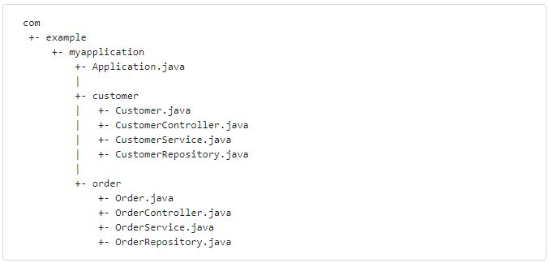

# String Boot 사용하기
---
1. [Build Systems](https://docs.spring.io/spring-boot/docs/2.4.3/reference/html/using-spring-boot.html#using-boot-build-systems)
2. [Structuring Your Code](https://docs.spring.io/spring-boot/docs/2.4.3/reference/html/using-spring-boot.html#using-boot-structuring-your-code)
3. [Configuration Classes](https://docs.spring.io/spring-boot/docs/2.4.3/reference/html/using-spring-boot.html#using-boot-configuration-classes)
4. [Auto-configuration](https://docs.spring.io/spring-boot/docs/2.4.3/reference/html/using-spring-boot.html#using-boot-auto-configuration)
5. [Spring Beans and Dependency Injection](https://docs.spring.io/spring-boot/docs/2.4.3/reference/html/using-spring-boot.html#using-boot-spring-beans-and-dependency-injection)
6. [Using the @SpringBootApplication Annotation](https://docs.spring.io/spring-boot/docs/2.4.3/reference/html/using-spring-boot.html#using-boot-using-springbootapplication-annotation)
7. [Running Your Application](https://docs.spring.io/spring-boot/docs/2.4.3/reference/html/using-spring-boot.html#using-boot-running-your-application)
8. [Developer Tools](https://docs.spring.io/spring-boot/docs/2.4.3/reference/html/using-spring-boot.html#using-boot-devtools)
9. [Packaging Your Application for Production](https://docs.spring.io/spring-boot/docs/2.4.3/reference/html/using-spring-boot.html#using-boot-packaging-for-production)
10. [What to Read Next](https://docs.spring.io/spring-boot/docs/2.4.3/reference/html/using-spring-boot.html#using-boot-whats-next)

##2. 코드 구조화
 - Spring Boot를 사용하기 위한 특정한 layout이 필요하진 않다.
 
###2.1 *"default"* Package 사용하기

"*"default package"* 사용 지양해야 한다.    
왜냐하면 Spring Boot Application에서는 ``@ComponentScan``, ``@ConfigurationPropertiesScan``, ``@EntityScan``, ``@SpringBootApplication`` 같은 annotation들을 사용 할 때, 모든 jar로부터 모든 class를 읽어야 하기 때문에 
>*"default package"* 란?   
> - class에 ``package``선언이 포함되지 않는 경우 ex) src/main/java 하위에 바로 class파일 생성하는 경우
> - unnamed package 라고도 불리고 같은 default package 내가 아니라면 class import 불가능.

###2.2 Main Application Class 찾기
 
Spring Boot 공식 문서에서는 Main Application Class를(Main method를 가진 class) Root package에 위치하는것을 일반적으로 추천한다.   
보통 Main Application Class에는 보통 [``@SpringBootApplication`` annotation](https://docs.spring.io/spring-boot/docs/2.4.3/reference/html/using-spring-boot.html#using-boot-using-springbootapplication-annotation)이 붙어 있는데, 이는 이 main class가 위치한 package가 기본 package임을 정의한다.
      

JPA 어플리케이션을 만들 때, ``@EnableAutoConfiguration``이 붙은 클래스의 패키지는 @Entity를 찾는데 사용된다.   
[Spring JPA Data Docs](thttps://docs.spring.io/spring-data/jpa/docs/2.3.3.RELEASE/reference/html/#jpa.repositories)
    
<details>
<summary>ORM, JPA</summary>

<div markdown="1">

> ORM(Object-relational mapping) 이란?
> - Object-relational mapping
>   - object는 object대로 설계하고, RDB는 RDB대로 설계한다.
>   - ORM framework가 object와 RDB를 중간에서 mapping 해준다.
> JPA(Java Persistence API)란?   
> - EJB
>   - 과거의 자바 표준(Entity Bean) : DB에서 가져온 data를 객체로 표현하기 위한 것
>       - Entity Bean = DB에 있는 하나의 row
>       - Entity Bean을 수정하면 자동으로 DB에 있는 값이 수정된다 - > EJB container가 DB를 연결하는 코드를 자동으로 생성해준다.
>   - 문제
>       - SQL에 의존적인 개발을 함 (객체지향과 RDB관의 패러다임 불일치 등)
>       - 코드가 매우 지저분하다
>       - api 복잡성이 높다 (interface를 많이 구현해야 한다.)
>       - [등등](https://gmlwjd9405.github.io/2019/08/04/what-is-jpa.html)
> - Hibernate
>   - ORM framework이며 Open Source이다.
>   - EJB 대체 목적으로 만들어짐
> - JPA (Java Persistence API)
>   - Java 에서의 ORM 기술 표준으로, ``interface의 모음``
>       - 실제로 동작하는것은 아님.
>       - JPA interface를 구현한 대표적인 오픈소스가 Hibernate   
>   - 기본 동작
>       - 
>           개발자가 직접 jdbc api를 사용하는게 아니라 jpa 내부에서 jdbc api를 사용해서 sql로 db와 통신한다.
>   - INSERT 과정
>       - Member 객체를 INSERT 하고 싶을 때
>           - 개발자는 MemberDAO 객체를 만들어서 JPA에 넘긴다.
>           - JPA는 Member entity를 분석하고, INSERT SQL을 생성하고 JDBC API를 사용해서 SQL을 DB에 날린다.
>   - SELECT 과정
>       - Member 객체를 SELECT 하고 싶을 때
>           - 개발자는 member의 pk 값을 JPA에 넘긴다.
>           - JPA는 entity의 mapping 정보를 바탕으로 적절한 SELECT SQL을 생성 -> JDBC API를 사용해서 SQL을 DB에 날린다 -> DB로부터 결과를 받아온다 -> ResultSet을 Object에 mapping한다.
>       - SQL을 JPA가 만들어 주기 때문에 Object와 RDB간의 패러다임 불일치를 해결 할 수 있다. 
>
> 참고 : [Entity Bean](https://kimseunghyun76.tistory.com/327), [JPA 소개 및 JPA의 기본 동자 과정](https://gmlwjd9405.github.io/2019/08/04/what-is-jpa.html)

</div>
</details>

루트 패키지를 사용하는 것은 ``basePackage``를 특정할 필요 없이 ``@ComponentScan`` annotation을 사용하는 것을 허용한다. 또한 Main Class가 root package에 있는 경우, @SpringBootApplication annotation을 사용할 수 있다.

일반적인 layout
    

위에 있는 일반적인 layout 기준 ``Application.java`` 파일은 기본 ``@Configuration``과 함께 ``main`` 메소드를 선언한다.
```java
package com.example.myapplication;

import org.springframework.boot.SpringApplication;
import org.springframework.boot.autoconfigure.SpringBootApplication;

@SpringBootApplication
public class Application {

    public static void main(String[] args) {
        SpringApplication.run(Application.class, args);
    }

}
```