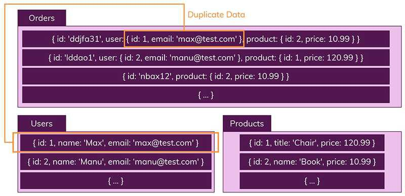

# [Working with NoSQL Technologies](https://docs.spring.io/spring-boot/docs/2.4.3/reference/html/spring-boot-features.html#boot-features-nosql)

---

Spring Data는 다양한 NoSQL 기반의 DB를 제공한다.

- [MongoDB](https://spring.io/projects/spring-data-mongodb)
- [Neo4J](https://spring.io/projects/spring-data-neo4j)
- [Elasticsearch](https://spring.io/projects/spring-data-elasticsearch)
- [Solr](https://spring.io/projects/spring-data-solr)
- [Redis](https://spring.io/projects/spring-data-redis)
- [GemFire](https://spring.io/projects/spring-data-gemfire) or [Geode](https://spring.io/projects/spring-data-geode)
- [Cassandra](https://spring.io/projects/spring-data-cassandra)
- [Couchbase](https://spring.io/projects/spring-data-couchbase)
- [LDAP](https://spring.io/projects/spring-data-ldap)

## SQL과 RDB란?
SQL은 Structured Query Language(구조화된 쿼리 언어)의 약자로서, RDBMS에서 데이터를 저장, 수정, 삭제 및 검색하는데 사용되는 언어이다.   

보통 RDB에서는 두 가지 주요 특징이 존재한다.
 - 데이터는 ``정해진 데이터 스키마``를 따라 DB 테이블에 저장된다.
    - 데이터는 테이블의 recode(row)로 저장되며, 각 테이블은 명확하게 정의된 구조가 있다.
     따라서, 테이블에 미리 정의된 필드가 아니라면 해당 테이블에 데이터를 저장할 수 없다.
 - 데이터는 ``관계``를 통해서 연결된 여러개의 테이블에 분산되어 저장된다.
    - RDB에서는 데이터를 여러개의 테이블에 나눠서 저장하기 때문에, 데이터들의 중복을 피할 수 있다.
     테이블마다 저장하는 데이터의 목적이 존재한다.
      
 

### 관계형 DB가 가지고 있는 특성
- Transaction(트랜잭션) : query를 하나의 단위로(트랜잭션) 묶어서 만약 중간에 실행이 중단되거나 문제가 발생한 경우, 처음부터 다시 실행하는 Rollback을 수행하고, 오류없이 실행을 마치면 commit 하는 실행 단위를 말한다.
- ACID 특성
    - Atomic(원자성) : 트랜잭션 작업이 부분적으로 실행되거나 중단되지 않는 것을 보장함. (save point 지정 가능)
    - Consistency(일관성) : 트랜잭션이 성공적으로 끝나면 일관적인 DB 상태를 유지함. (어떤 이벤트와 조건을 기반으로 trigger 지정 가능)   
      데이터 모델의 모든 제약조건 등을 만족해야함. 기본키, 외래키, 도메인, 제약조건 등등
    - Isolation (격리성) : 트랜잭션 수행 시 다른 트랜잭션이 간섭할 수 없음(때때로 트랜잭션이 거의 동시에 처리될 수 있는데 이때의 결과가 순차적으로 처리될 때의 결과와 동일해야함)
    - Durability(지속성) : commit하면 그 상태를 영원히 보장함.

## NoSQL 이란? (MongoDB 기준)
[NoSQL용어의 등장](https://jwprogramming.tistory.com/70)   
NoSQL은 "Not Only SQL"이라고도 불린다. 
(사실 예전에는 NoSQL, Not Only SQL, Non-Relational Operational Database SQL 등으로도 해석했음)   
즉, 기존 ``RDB(관계형 DB)가 가지고 있는 특성 뿐만 아니라 다른 특성들을 부가적으로 지원``한다는 것을 의미한다.   
key-value, document(MongoDB), graph 등의 여러가지 저장 구조를 가지는 NoSQL들이 존재한다.

RDB와 반대대는 특징들
 - 정해진 스키마가 없다.
 - 관계가 없다.
 - RDB의 "ACID" 대신 Eventual Consistency 개념을 사용한다.
    - 데이터가 중복되어 저장될 수 있기 때문에 일관성을 유지하기 어렵다.   
      그래서 꼭 실제로 최신으로 반영된 데이터는 아닐 수 있지만, ``업데이트가 되기 전까지는`` 가지고있는 가장 최신의 데이터를 반환한다는 개념 

RDB에서의 Recode(Row)를 NoSQL에서는 documents라고 부른다. documents는 JSON과 비슷한 형태이다.
RDB에서는 정해진 스키마에 해당하는 데이터만 추가할 수 있지만, NoSql에서는 정해진 스키마가 없기 때문에 다른 구조의 데이터를 같은 컬렉션을(=RDB에서 테이블) 추가할 수 있다.

RDB에서는 각각 Orders, Users, Products 테이블을 만들어서 각각의 테이블에 데이터를 넣어줬다면, NoSQL의 경우 위의 그림처럼 하나의 Orders Collection에 모든 정보(User와 Products)를 같이 저장한다.
따라서, NoSQL에서는 RDB와 다르게 Join이라는 개념이 존재하지 않는다.(사용할 수 있는 방안이 있다고는 하지만 일반적인 방법이 아니라고 한다.)

NoSQL의 방식은 복잡하고 느린 조인문을 사용하지 않아도 되는 큰 장점이 있지만 데이터가 중복되어 저장될 수 있는 구조이기 때문에 특정 데이터를 같이 사용하는 모든 Collection에서 똑같은 데이터를 업데이트 할 수 있도록 해야한다.   
특히, 자주 변경되지 않는 데이터인 경우에 NoSQL을 사용하는 것이 더 좋다.

## SQL vs NoSQL

### 사용되는 용어
|SQL|MongoDB|Cassandra|
|---|---|---|
|Table|Collection|Table|
|Row|Document|Row|
|Column|Field|Column|
|Primary Key|ObjectId|Primary Key|
|Index|Index|Index|
|View|View|Materialized View|
|Nested table or object|Embedded document|Map|
|Array|Array|List|

### 확장성(Scaling)
데이터베이스를 비교할 때 중요한 개념 중 하나가 확장성이다.
총 2가지 방식이 존재하는데, 수직적 확장과 수평적 확장이다.

- 수직적(vertical) 확장
    - CPU, RAM 등을 추가하거나 교체해서 단순히 DB 서버의 성능을 향상시키는 것.
- 수평적(horizontal) 확장 
    - 더 많은 서버를 추가해서 DB를 전체적으로 분산시키는 것을 의미한다.

