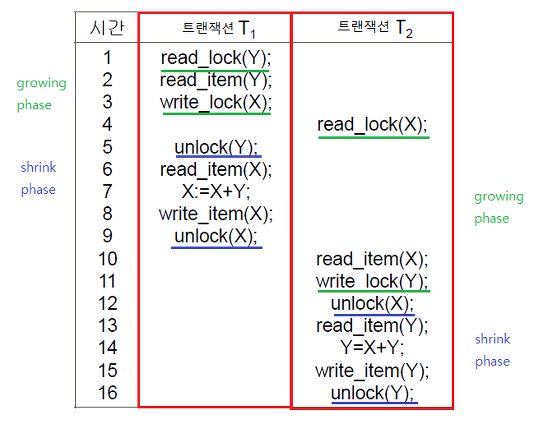

# [Working with NoSQL Technologies](https://docs.spring.io/spring-boot/docs/2.4.3/reference/html/spring-boot-features.html#boot-features-nosql)

---

Spring Data는 다양한 NoSQL 기반의 DB를 제공한다.

- [MongoDB](https://spring.io/projects/spring-data-mongodb)
- [Neo4J](https://spring.io/projects/spring-data-neo4j)
- [Elasticsearch](https://spring.io/projects/spring-data-elasticsearch)
- [Solr](https://spring.io/projects/spring-data-solr)
- [Redis](https://spring.io/projects/spring-data-redis)
- [GemFire](https://spring.io/projects/spring-data-gemfire) or [Geode](https://spring.io/projects/spring-data-geode)
- [Cassandra](https://spring.io/projects/spring-data-cassandra)
- [Couchbase](https://spring.io/projects/spring-data-couchbase)
- [LDAP](https://spring.io/projects/spring-data-ldap)

## NoSQL이란?
[NoSQL용어의 등장](https://jwprogramming.tistory.com/70)   
NoSQL은 "Not Only SQL"이라고도 불린다. 
(사실 예전에는 NoSQL, Not Only SQL, Non-Relational Operational Database SQL 등으로도 해석했음)   
즉, 기존 ``RDB(관계형 DB)가 가지고 있는 특성 뿐만 아니라 다른 특성들을 부가적으로 지원``한다는 것을 의미한다.   

 - 스키마  

### 관계형 DB가 가지고 있는 특성
 - Transaction(트랜잭션) : query를 하나의 단위로(트랜잭션) 묶어서 만약 중간에 실행이 중단되거나 문제가 발생한 경우, 처음부터 다시 실행하는 Rollback을 수행하고, 오류없이 실행을 마치면 commit 하는 실행 단위를 말한다.
 - ACID 특성
    - Atomic(원자성) : 트랜잭션 작업이 부분적으로 실행되거나 중단되지 않는 것을 보장함. (save point 지정 가능)
    - Consistency(일관성) : 트랜잭션이 성공적으로 끝나면 일관적인 DB 상태를 유지함. (어떤 이벤트와 조건을 기반으로 trigger 지정 가능)   
                        데이터 모델의 모든 제약조건 등을 만족해야함. 기본키, 외래키, 도메인, 제약조건 등등
    - Isolation (격리성) : 트랜잭션 수행 시 다른 트랜잭션이 간섭할 수 없음   
                        트랜잭션을 병행처리(concurrent processing) 할 수 있는데 2PL 프로토콜을 사용해야만 Isolation을 보장할 수 있음.
        - 2PL 프로토콜이란?   
         여러 트랜잭션이 공유하고 있는 데이터에 동시에 접근할 수 없도록 하기위한 목적을 가진 프로토콜. OS의 세마포어와 비슷한 개념으로 lock을 걸어 사용함.
         
    - Durability(지속성) : commit하면 그 상태를 영원히 보장함.
 
