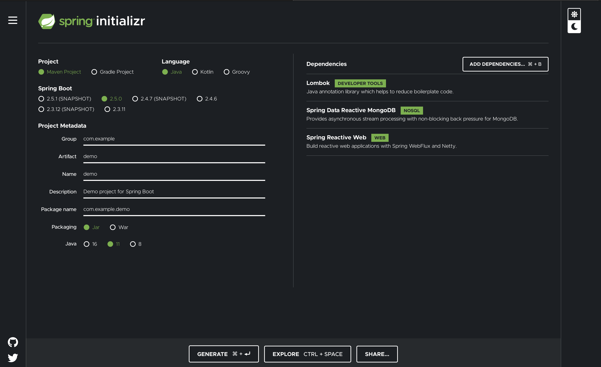

# Working with NoSQL Technologies


## Reactive Transactions in MongoDB 


프로젝트 실습을 위해 의존성은 아래와 같이 3가지를 추가한다.

- Lombok
- Spring Data Reactive MongoDB
- Spring Reactive Web




실습환경은 MongoDB가 설치되어야 하며, 실행 스크립트는 아래와 같다.

```bash
data=$HOME/Desktip/mongodb-data
mkdir -p $data
mongod --replSet my-replica-set --dbpath $data &
mongo --eval "rs.initiate()"
```


MongoDB 도큐먼트 도메인을 정의한다. (편의를 위해 롬복을 사용하였으므로, 실제 도메인에 롬복 사용시에는 주의)

도큐먼트는 관계형 데이터베이스의 테이블와 비슷하다.

도큐먼트는 식별자를 가질 수 있다.

```java
@Data
@AllArgsConstructor
@NoArgsConstructor
@Document
class Customer {
	@Id
	private String id;
	private String email;
}
```


Repository를 정의하자.

우리는 R2DBC를 사용하므로 CrudRepository가 아닌, ReactiveCrudRepsitory를 상속해야 한다.

```java
interface CustomerRepository extends ReactiveCrudRepository<Customer, String> {
}
```


Transaction을 위한 Bean을 두 가지 설정한다.

```java
@SpringBootApplication
public class MongoR2dbcApplication {

	public static void main(String[] args) {
		SpringApplication.run(MongoR2dbcApplication.class, args);
	}

	@Bean
	TransactionalOperator transactionalOperator(ReactiveTransactionManager txm) {
		return TransactionalOperator.create(txm);
	}
	@Bean
	ReactiveTransactionManager transactionManager(ReactiveMongoDatabaseFactory dbf) {
		return new ReactiveMongoTransactionManager(dbf);
	}
}
```

- TransactionalOperator : 프로그래밍 방식의 트랜잭션 경계를 설정하고 트랜잭션 예외를 처리하는 객체다.
- ReactiveTransactionManager: TransactionOperator는 low-level방식인데 비해, ReactiveTransactionManager는 AOP를 적용한 트랜잭션 방식이다.

- **트랜잭션을 적용하려면 이 두 가지 객체 중 하나를 사용하면 된다.**


## 방법 1, TransactionalOperator

트랜잭션이 적용될 Service를 작성하자.

```java
@Service
@RequiredArgsConstructor
class CustomerService {
	private final CustomerRepository customerRepository;

	private final  TransactionalOperator transactionalOperator;
	public Flux<Customer> saveAll(String ...emails) {
		final Flux<Customer> customerFlux = Flux.just(emails)
			.map(email -> new Customer(null, email))
			.flatMap(customerRepository::save)
			.doOnNext(customer -> Assert.isTrue(customer.getEmail().contains("@"), "the email must contain '@'!"));

    // 다음을 한 줄로 작성할 수 있다.
		// return transactionalOperator.execute(new TransactionCallback() {
		//
		// 	@Override
		// 	public Publisher<Customer> doInTransaction(ReactiveTransaction status) {
		// 		return customerFlux;
		// 	}
		// });
		return transactionalOperator.execute(status -> customerFlux);
	}
}
```

- `.doOnNext()` 부분이 핵심이다.
- 만약 email에 `"@"` 가 없다면 에러를 발생시켜, Transaction을 커밋하지 않는다.

>트랜잭션오퍼레이터를 아래와 같이 한줄에 작성 할 수 있다.
>
>```java
>return Flux.just(emails)
>   .map(email -> new Customer(null, email))
>   .flatMap(customerRepository::save)
>   .as(this.transactionalOperator::transactional);
>```

테스트를 작성하여 확인해보자

```java

@SpringBootTest
@RunWith(SpringRunner.class)
public class CustomerServiceTest {

	@Autowired
	CustomerService customerService;

	@Autowired
	CustomerRepository customerRepository;

	@Test
	public void saveAll() throws Exception {
    // (1)
		StepVerifier
			.create(customerRepository.deleteAll())
			.verifyComplete();
    // (2)
		StepVerifier
			.create(customerService.saveAll("a@a.com", "b@b.com", "c@c.com", "d@d.com"))
			.expectNextCount(4)
			.verifyComplete();
    // (3)
		StepVerifier
			.create(customerRepository.findAll())
			.expectNextCount(4)
			.verifyComplete();
    // (4)
		StepVerifier
			.create(customerService.saveAll("e@e.com","2"))
			.expectNextCount(1)
			.expectError()
			.verify();
    // (5)
		StepVerifier
			.create(customerRepository.findAll())
			.expectNextCount(4)
			.verifyComplete();

	}
}
```

- (1) 테스트 전에 저장된 Customer 도큐먼트를 모두 지운다.
- (2) **유효한** 이메일을 입력시키도록 한다. 결과는 4개 모두 정상적으로 입력되어야 한다.
- (3) 2번에서 저장한 값을 가져오는 테스트다.
- (4) "e@e.com"은 유효한 이메일이지만, "2"는 유효하지 않으므로 에러를 발생시켜야 한다.
- (5) 4번에서 트랜잭션이 제대로 적용되었다면 4번의 트랜잭션은 취소되어야 하므로, 도큐먼트 4개가 저장되어야 한다.


## 방법 2, ReactiveTransactionManager

`@Configuration` 클래스에 `@EnableTransactionManagement` 어노테이션을 추가한다.

```java
@SpringBootApplication
@EnableTransactionManagement
public class MongoR2dbcApplication {

	public static void main(String[] args) {
		SpringApplication.run(MongoR2dbcApplication.class, args);
	}

	@Bean
	TransactionalOperator transactionalOperator(ReactiveTransactionManager txm) {
		return TransactionalOperator.create(txm);
	}
	@Bean
	ReactiveTransactionManager transactionManager(ReactiveMongoDatabaseFactory dbf) {
		return new ReactiveMongoTransactionManager(dbf);
	}
}

```

서비스 로직을 다음과 같이 작성한다.

```java

@Service
@RequiredArgsConstructor
class CustomerService {
	private final CustomerRepository customerRepository;

	private final  TransactionalOperator transactionalOperator;

	@Transactional
	public Flux<Customer> saveAll(String ...emails) {
		 return Flux.just(emails)
			.map(email -> new Customer(null, email))
			.flatMap(customerRepository::save)
			.doOnNext(customer -> Assert.isTrue(customer.getEmail().contains("@"), "the email must contain '@'!"));
	}
}
```

- @Transactional은 spring data jpa와 같은 `org.springframework.transaction.annotation.Transactional`을 사용한다.


---

https://www.youtube.com/watch?v=9henAE6VUbk
